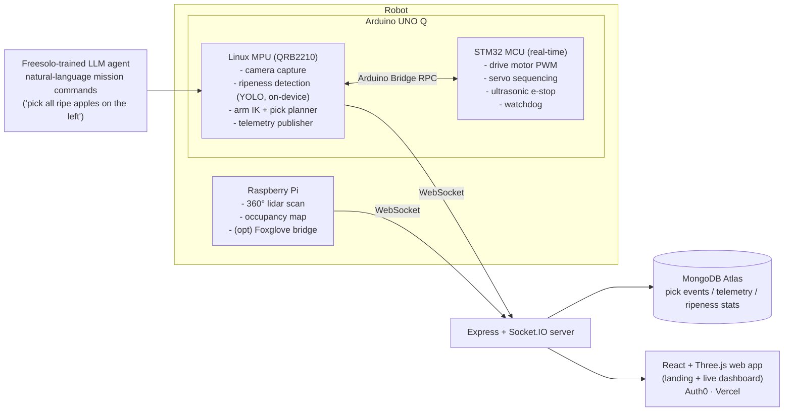

# 🍎 Hack the 6ix 2026 — Autonomous Fruit-Picking Robot

> **"Battery, not Blood."** Low-cost autonomous robotics to pick fruit, cut labor costs, reduce food waste, and lower the price of food globally.

A custom rover + 5-DOF robotic arm with an **eye-in-hand camera** that finds 3D-printed **apples and bananas**, classifies type + ripeness with on-device edge AI, picks them, and **sorts them into the correct bin** — with PlayStation-controller teleop and everything (lidar map, camera, pick stats, ripeness analytics) streaming to a live web dashboard.

🌐 **Live**: https://hack-the-6ix-3uawu061s-daniel-w-lius-projects.vercel.app · **Repo**: https://github.com/danielwliuhosa/hack-the-6ix

## Why this wins

- **Technical difficulty**: custom arm IK + on-device edge AI + SLAM/lidar + real-time telemetry — almost no heavy lifting done by external APIs.
- **Uniqueness**: full-stack physical robot with a polished web presence; rare at software-heavy hackathons.
- **Design**: manga-shader Three.js landing page, Foxglove/Three.js live robot viz, clean dashboard.
- **Completeness**: staged milestones (see [docs/PLAN.md](docs/PLAN.md)) so we always have a working demo at every checkpoint.

## Architecture

## Repo layout

| Path | What lives here |
|---|---|
| `firmware/mcu/` | Arduino UNO Q STM32 side — motors, servo sequencing, safety |
| `firmware/linux/` | UNO Q Linux side — vision inference, IK, pick state machine |
| `robot/vision/` | Ripeness detection model + camera pipeline dev |
| `robot/lidar/` | Raspberry Pi lidar reader + map streaming |
| `web/` | React + Three.js app, Express/Socket.IO server (deployed on Vercel) |
| `ml/ripeness/` | Detection/ripeness model training (YOLO on apple dataset) |
| `ml/freesolo-agent/` | Freesolo LLM post-training for NL robot commanding |
| `cad/` | 3D-print STLs for arm, mounts, gripper |
| `docs/` | [PLAN](docs/PLAN.md) · [TRACKS](docs/TRACKS.md) · [HARDWARE](docs/HARDWARE.md) |

## Prize tracks we're targeting

1st/2nd/3rd overall · **Best Environmental Hack** · **Qualcomm (Arduino UNO Q edge AI)** · **Deloitte AI for Green** · **Freesolo (LLM training)** · MLH MongoDB Atlas · MLH Auth0 — full strategy and requirement checklists in [docs/TRACKS.md](docs/TRACKS.md).
