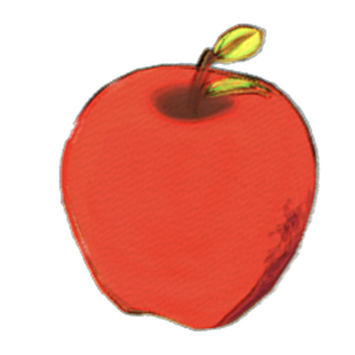
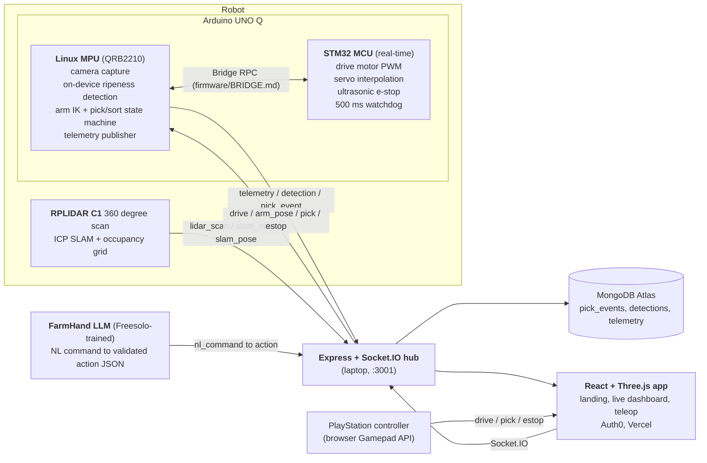

<p align="center">
  
</p>

<h1 align="center">Pomme</h1>

<p align="center"><b>Battery, not Blood.</b> An autonomous fruit-picking and sorting robot, built at Hack the 6ix 2026.</p>

<p align="center">
  <a href="https://pomme.live/">pomme.live</a>
  &nbsp;|&nbsp;
  <a href="https://github.com/DanielWLiu07/hack-the-6ix">Repo</a>
  &nbsp;|&nbsp;
  <a href="docs/DEVPOST.md">Pitch</a>
  &nbsp;|&nbsp;
  <a href="docs/TRACKS.md">Tracks</a>
</p>

---

## What it is

30 to 40 percent of food is lost between harvest and shelf, much of it to labor shortage and slow, late grading. Pomme is a low-cost robot that picks fruit and sorts it by ripeness at the point of harvest, attacking food waste, food prices, and brutal stoop labor in one machine.

Concretely: a custom rover with a 5-DOF robotic arm drives itself to fruit. A camera mounted on the arm (eye-in-hand) finds each fruit and classifies its type and ripeness with AI that runs on the robot itself, no cloud. The arm picks the fruit and drops it into the correct bin (apple or banana, ripe or unripe). A 360 degree lidar feeds a SLAM pipeline that builds a live map for autonomous navigation, a PlayStation controller gives manual teleop, and a natural-language layer called FarmHand turns a command like "pick all the ripe apples" into a validated robot action. Everything streams live to a web dashboard.

## How it works, end to end

1. The arm camera captures a frame. The on-device vision model detects each fruit and labels it apple or banana, ripe or unripe.
2. The pick-and-sort planner computes the arm joint angles to reach the fruit (inverse kinematics), closes the gripper, and carries it to the matching bin.
3. Motor and servo timing, plus the safety stop, run on a separate real-time chip so motion is smooth and never blocked by the heavier AI work.
4. The lidar SLAM node turns raw 360 degree scans into a live occupancy map and robot pose, which drive navigation and the dashboard map.
5. A laptop server (the hub) relays every message (telemetry, detections, pick events, lidar scans) between the robot and the browser in real time.
6. The web dashboard renders live telemetry, a pick log, the camera feed, and the 3D lidar map. An operator can take over with a PlayStation controller or issue plain-English commands through FarmHand.
7. Nothing here needs the physical robot to demo: every hardware component has a simulated stand-in, so the whole system runs on a laptop today.

---

## Quickstart, one command boots the whole demo

The entire system runs on a laptop with zero hardware. Every physical component (robot, camera, lidar) has a simulated backend, so the dashboard, telemetry, vision fallback, lidar map, and FarmHand assistant all work today.

```bash
git clone https://github.com/DanielWLiu07/hack-the-6ix && cd hack-the-6ix
./scripts/demo.sh          # boots: Socket.IO hub, robot node (mock), lidar sim, web dev server
```

Then open http://localhost:5173 for the dashboard. You will see live telemetry, detections, pick events, and the lidar point cloud streaming from the simulator.

Verify the stack is healthy (exit 0 means all green):

```bash
./scripts/check-stack.sh   # hub up, socket handshake, sim emitting, REST endpoints, /stream
```

<details>
<summary>Manual boot (start pieces individually)</summary>

```bash
# 1. Telemetry hub + simulated robot  (Express + Socket.IO, port 3001)
cd web/server && npm install && npm start

# 2. Web dashboard  (Vite, port 5173)
cd web && npm install && npm run dev

# 3. Lidar simulator to hub
python3 robot/lidar/sim/sim.py

# 4. FarmHand NL command demo (mock model, no endpoint needed)
python3 ml/freesolo-agent/client/demo_driver.py
```
</details>

---

## Tech stack

### On the robot

- **Arduino UNO Q**, the robot's brain: one board carrying two processors on purpose. A Linux computer (the MPU) runs the camera, the AI, and the planning; a real-time microcontroller (the MCU) runs the motors. This split is a deliberate design choice, not an accident of wiring.
- **Qualcomm Dragonwing QRB2210 (Linux MPU)**, the high-level half. It captures the camera, runs the vision model on-device inside a roughly 5 W envelope, computes the arm math, runs the pick-and-sort state machine, and publishes telemetry.
- **STM32U585 (real-time MCU)**, the safety half. It generates the drive motor PWM, interpolates the five arm servos on a 20 ms tick so the arm never snaps, reads the ultrasonic sensor for a reflex emergency stop in under 10 ms with no Linux round-trip, and runs a 500 ms watchdog that halts all motion if the Linux side goes quiet.
- **On-device vision**, trained and deployed with Edge Impulse for the final build, with a locally trained YOLOv8n (exported to ONNX int8) and an OpenCV HSV fallback as interchangeable backends behind one detector interface. All inference runs on the robot; raw frames never leave the board.
- **RPLIDAR C1 360 degree lidar + SLAM**: scan-to-scan ICP odometry with a log-odds occupancy grid (`robot/lidar/`), producing a live map and pose for navigation and the dashboard.
- **Custom hardware**: 3D-printed 5-DOF arm (PCA9685 servo driver), BTS7960 motor drivers on a differential drive base, multi-rail buck power stack, LiPo battery. CAD in `cad/`.

### The AI assistant

- **FarmHand**, a small language model fine-tuned on the Freesolo platform (SFT plus GRPO reinforcement learning). It turns a plain-English instruction into a strict, schema-validated action: "pick all ripe apples" becomes `{task: pick, fruit: apple, filter: ripe}`. Anything malformed is rejected before it can reach the robot; ambiguous commands get a clarifying question instead of a guess.

### Server and web

- **Express + Socket.IO hub**, the switchboard on a laptop at the venue: every robot message fans out to the browser, every operator command flows back to the robot.
- **MongoDB Atlas** stores pick events, detections, and telemetry for the analytics page (in-memory fallback when unconfigured, so the demo never blocks).
- **React + Vite** for the dashboard, **Three.js** (with react-three-fiber) for the 3D lidar map, robot view, and the painterly landing scene.
- **Auth0** gates the teleop page so only a signed-in operator can drive the robot.
- **Vercel** hosts the public dashboard at [pomme.live](https://pomme.live/).
- **PlayStation controller via the browser Gamepad API** for teleop: stick and button input becomes drive, pick, and emergency-stop commands.

---

## Architecture

An intentional MPU/MCU split on the Arduino UNO Q, genuine on-device inference, and a laptop-hosted telemetry hub fanning everything out to the web.



Full split rationale and on-device benchmark methodology: [`docs/QUALCOMM.md`](docs/QUALCOMM.md). Message schemas (the contract every component conforms to): [`docs/SCHEMAS.md`](docs/SCHEMAS.md).

---

## Prize tracks, the claim and the evidence

Each row is a claim a judge can check by opening the linked file.

| Track | What we claim | Evidence |
|---|---|---|
| **Best Hardware** | Fully custom build: 3D-printed 5-DOF arm, custom drive base, multi-rail power stack, dual-brain control, lidar SLAM | [`cad/`](cad/), [`firmware/`](firmware/), [`docs/HARDWARE.md`](docs/HARDWARE.md) |
| **Qualcomm, Arduino UNO Q** | Intentional MPU/MCU split + genuine on-device AI (no cloud inference, ever) | [`docs/QUALCOMM.md`](docs/QUALCOMM.md), bench harness [`robot/vision/bench.py`](robot/vision/bench.py), exported model [`ml/ripeness/export/`](ml/ripeness/export/) |
| **Deloitte, AI for Green** | AI for sustainability (food waste) and sustainable AI (about 5 W edge inference vs 70 to 300 W cloud GPU); dashboard computes waste-avoided from real pick events | [`docs/DEVPOST.md`](docs/DEVPOST.md), `/api/stats` in [`web/server/store.js`](web/server/store.js) |
| **Freesolo, Best Model Trained** | FarmHand: NL command to structured action JSON, trained with SFT + GRPO, evaluated on held-out sets | Dataset + eval in [`ml/freesolo-agent/`](ml/freesolo-agent/), live transcript [`DEMO_TRANSCRIPT.md`](ml/freesolo-agent/client/DEMO_TRANSCRIPT.md) |
| **MLH MongoDB Atlas** | Primary store for pick events, telemetry, detections | [`docs/DATA.md`](docs/DATA.md), [`web/server/db/`](web/server/db/) |
| **MLH Auth0** | Operator-auth gate on the teleop dashboard | [`web/src/`](web/src/) |

Full strategy and the Devpost checklist: [`docs/TRACKS.md`](docs/TRACKS.md).

---

## Repo layout

| Path | What lives here |
|---|---|
| [`firmware/mcu/`](firmware/mcu/) | UNO Q STM32 side: drive motors, servo sequencing, ultrasonic e-stop, watchdog |
| [`firmware/linux/`](firmware/linux/) | UNO Q Linux side: camera, on-device inference, IK, pick/sort state machine, telemetry |
| [`firmware/BRIDGE.md`](firmware/BRIDGE.md) | The exact MCU-to-Linux RPC contract both sides conform to |
| [`robot/vision/`](robot/vision/) | Camera pipeline, HSV fallback detector, on-device FPS bench |
| [`robot/lidar/`](robot/lidar/) | RPLIDAR C1 SLAM node (ICP + occupancy grid) and a scan simulator |
| [`ml/ripeness/`](ml/ripeness/) | Fruit-type + ripeness model: training, export (ONNX + int8) |
| [`ml/freesolo-agent/`](ml/freesolo-agent/) | FarmHand NL-command dataset, training configs, eval, inference client |
| [`web/`](web/) | React + Three.js app (Vercel) + Express/Socket.IO telemetry hub |
| [`cad/`](cad/) | 3D-print STLs for arm, mounts, gripper |
| [`docs/`](docs/) | [SCHEMAS](docs/SCHEMAS.md), [PLAN](docs/PLAN.md), [TRACKS](docs/TRACKS.md), [DEVPOST](docs/DEVPOST.md), [QUALCOMM](docs/QUALCOMM.md), [DATA](docs/DATA.md), [HARDWARE](docs/HARDWARE.md), [DEPLOY](docs/DEPLOY.md) |

---

Built at Hack the 6ix 2026. Simulate-everything design: no one needs the physical robot in hand to see the whole system work.
