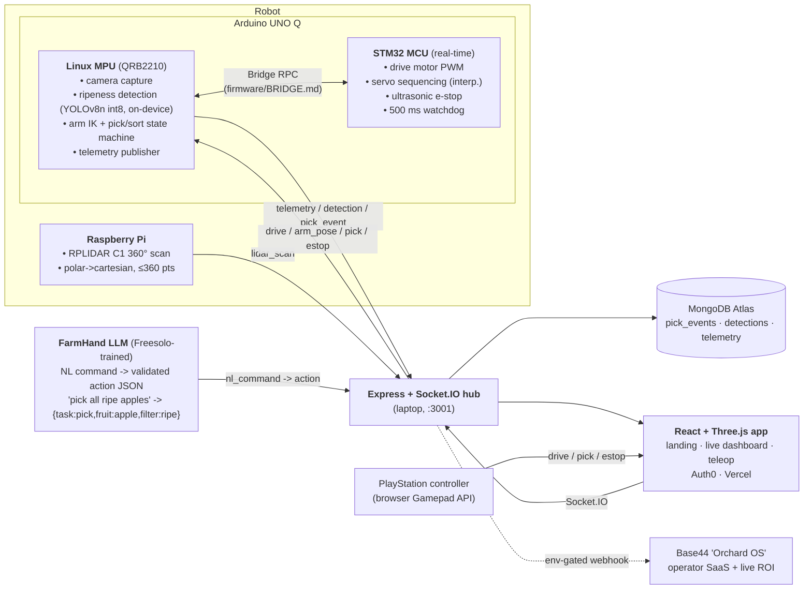

# Hack the 6ix 2026 - Autonomous Fruit-Picking & Sorting Robot

> ## "Battery, not Blood."
> 30–40% of food is lost between harvest and shelf - much of it to labor shortage and slow, late grading. A **low-cost robot that picks _and_ sorts by ripeness at the point of harvest** attacks food waste, food prices, and brutal stoop labor in one machine.

A custom rover + **5-DOF robotic arm** with an **eye-in-hand camera** finds 3D-printed **apples and bananas**, classifies fruit type + ripeness with **on-device edge AI** (no cloud), picks them, and **drops each into the correct bin**. A **PlayStation controller** gives teleop, a **360° lidar** streams a live map, and a natural-language **"FarmHand" LLM** turns spoken commands like _"pick all the ripe apples on the left"_ into validated robot actions. Everything streams live to a **React + Three.js dashboard**.

**Live dashboard**: https://hack-the-6ix-3uawu061s-daniel-w-lius-projects.vercel.app
**Repo**: https://github.com/DanielWLiu07/hack-the-6ix
**Pitch & story**: [`docs/DEVPOST.md`](docs/DEVPOST.md) · [`docs/TRACKS.md`](docs/TRACKS.md)

---

## Quickstart - one command boots the whole demo

The entire system is runnable on a laptop with **zero hardware** - every physical component (robot, camera, lidar) has a simulated backend, so the dashboard, telemetry, vision fallback, lidar map, and FarmHand LLM all work today.

```bash
git clone https://github.com/DanielWLiu07/hack-the-6ix && cd hack-the-6ix
./scripts/demo.sh          # boots: Socket.IO hub · robot node (mock) · lidar sim · web dev server
```

Then open **http://localhost:5173** (dashboard) - you'll see live telemetry, detections, pick events, and the lidar point cloud streaming from the simulator.

**Verify the stack is healthy** (works standalone; CI-friendly, exit 0 = all green):

```bash
./scripts/check-stack.sh   # hub up -> socket handshake -> sim emitting -> REST endpoints -> /stream
```

<details>
<summary>Manual boot (if you'd rather start pieces individually)</summary>

```bash
# 1. Telemetry hub + simulated robot  (Express + Socket.IO, port 3001)
cd web/server && npm install && npm start

# 2. Web dashboard  (Vite, port 5173)
cd web && npm install && npm run dev

# 3. Lidar simulator -> hub
python3 robot/lidar/sim/sim.py

# 4. FarmHand NL command demo (mock model, no endpoint needed)
python3 ml/freesolo-agent/client/demo_driver.py
```
</details>

---

## Architecture

Intentional **MPU/MCU split** on the Arduino UNO Q (the Qualcomm track requirement), genuine **on-device inference**, and a laptop-hosted telemetry hub fanning everything out to the web.



Full split rationale + on-device FPS methodology: [`docs/QUALCOMM.md`](docs/QUALCOMM.md). Message schemas (the contract every component conforms to) live in [`CLAUDE.md`](CLAUDE.md).

---

## Prize tracks - the claim and the evidence

Each row is a claim a judge can check by opening the linked file. Everything below **runs today** unless marked _pending hardware_.

### Tier 1 - the project is built around these

| Track | What we claim | Evidence you can open |
|---|---|---|
| **Overall 1st–3rd** | Full-custom robotics + polished web app + completeness (a working demo at every checkpoint, not just the finale) | Staged milestone ladder in [`docs/PLAN.md`](docs/PLAN.md); one-command boot above; live dashboard link |
| **Best Environmental** | Food-waste / famine framing backed by **live** numbers, not slideware - dashboard computes waste-avoided from real pick events | [`docs/DEVPOST.md` § quantified impact](docs/DEVPOST.md) · `/api/stats` -> `waste_avoided_kg` in [`web/server/store.js`](web/server/store.js) |
| **Qualcomm - Arduino UNO Q** | Intentional **MPU/MCU split** + **genuine on-device AI** (no cloud inference, ever) | [`docs/QUALCOMM.md`](docs/QUALCOMM.md) - split rationale + bench harness [`robot/vision/bench.py`](robot/vision/bench.py); exported model [`ml/ripeness/export/`](ml/ripeness/export/) (`model.int8.onnx`) |
| **Deloitte - AI for Green** | Both dimensions: AI _for_ sustainability (food waste) **and** sustainable AI (~5 W quantized edge model vs. 70–300 W cloud GPU) | [`docs/DEVPOST.md` § Deloitte](docs/DEVPOST.md): ~60 kg/hr graded, ~150 kg CO₂e/hr avoided (one arm), frames-per-joule at 5 W |

### Tier 2 - meaningful extra work, big payoff

| Track | What we claim | Evidence you can open |
|---|---|---|
| **Freesolo - Best Model Trained** | **"FarmHand"**: NL command -> structured action JSON, with multi-turn clarification. Real SFT dataset + eval + working end-to-end integration | Dataset **2,349 train / 123 val / 30 held-out / 600 preference-pairs** in [`ml/freesolo-agent/data/`](ml/freesolo-agent/data/); eval harness [`data/eval.py`](ml/freesolo-agent/data/eval.py) (**regex baseline 28/30 = 93.3%** - the floor the model beats); live transcript [`client/DEMO_TRANSCRIPT.md`](ml/freesolo-agent/client/DEMO_TRANSCRIPT.md) |
| **Base44 - Venture Builder** | "Orchard OS" companion SaaS fed by a **real webhook** from the robot server (not a mock) | Build brief + integration [`docs/BASE44.md`](docs/BASE44.md); env-gated forwarder in [`web/server/`](web/server/) |

### Tier 3 - already in the stack, claim them

| Track | Evidence |
|---|---|
| **MLH MongoDB Atlas** | Primary DB for pick events / telemetry / detections - schemas + aggregation in [`docs/DATA.md`](docs/DATA.md), persistence layer in [`web/server/`](web/server/) (in-memory fallback when no `MONGODB_URI`) |
| **MLH Auth0** | Operator-auth gate on the teleop dashboard ([`web/src/`](web/src/), env-placeholder until venue creds) |
| **People's Choice** | Robots picking apples live in the venue - bring apples, let people command FarmHand |

Full strategy, the one-track rule, and the Devpost checklist: [`docs/TRACKS.md`](docs/TRACKS.md).

---

## Repo layout

| Path | What lives here |
|---|---|
| [`firmware/mcu/`](firmware/mcu/) | Arduino UNO Q **STM32 side** - drive motors, servo sequencing, ultrasonic e-stop, watchdog |
| [`firmware/linux/`](firmware/linux/) | UNO Q **Linux side** - camera, on-device inference, IK, pick/sort state machine, telemetry |
| [`firmware/BRIDGE.md`](firmware/BRIDGE.md) | The exact MCU<->Linux RPC contract both sides conform to |
| [`robot/vision/`](robot/vision/) | Camera pipeline + HSV fallback detector + on-device FPS bench |
| [`robot/lidar/`](robot/lidar/) | RPLIDAR C1 reader (Pi), iPhone-lidar world reconstruction, and a scan simulator |
| [`ml/ripeness/`](ml/ripeness/) | YOLOv8n fruit-type + ripeness model - training, export (ONNX + int8) |
| [`ml/freesolo-agent/`](ml/freesolo-agent/) | **FarmHand** NL-command dataset, eval, and inference client |
| [`web/`](web/) | React + Three.js app (Vercel) + Express/Socket.IO telemetry hub |
| [`cad/`](cad/) | 3D-print STLs for arm, mounts, gripper |
| [`docs/`](docs/) | [PLAN](docs/PLAN.md) · [TRACKS](docs/TRACKS.md) · [DEVPOST](docs/DEVPOST.md) · [QUALCOMM](docs/QUALCOMM.md) · [DATA](docs/DATA.md) · [BASE44](docs/BASE44.md) · [HARDWARE](docs/HARDWARE.md) · [DEPLOY](docs/DEPLOY.md) |

---

_Built at Hack the 6ix 2026. Simulate-everything design: no judge ever needs the physical robot in hand to see the whole system work._
