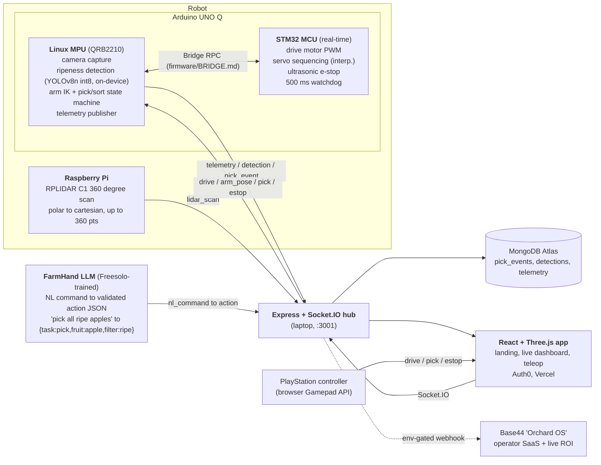

<p align="center">
  
</p>

<h1 align="center">Autonomous Fruit-Picking and Sorting Robot</h1>

<p align="center"><b>Battery, not Blood.</b> Built at Hack the 6ix 2026.</p>

<p align="center">
  <a href="https://hack-the-6ix-3uawu061s-daniel-w-lius-projects.vercel.app">Live dashboard</a>
  &nbsp;|&nbsp;
  <a href="https://github.com/DanielWLiu07/hack-the-6ix">Repo</a>
  &nbsp;|&nbsp;
  <a href="docs/DEVPOST.md">Pitch</a>
  &nbsp;|&nbsp;
  <a href="docs/TRACKS.md">Tracks</a>
</p>

---

## What it is

30 to 40 percent of food is lost between harvest and shelf, much of it to labor shortage and slow, late grading. This project is a low-cost robot that picks fruit and sorts it by ripeness at the point of harvest, attacking food waste, food prices, and brutal stoop labor in one machine.

Concretely: a custom rover with a 5-DOF (five-joint) robotic arm drives up to 3D-printed apples and bananas. A camera mounted on the arm (eye-in-hand) finds each fruit and classifies its type and ripeness using AI that runs on the robot itself (no cloud). The arm picks the fruit and drops it into the correct bin (apple or banana, ripe or unripe). A PlayStation controller gives a human manual control (teleop), a spinning 360-degree laser (lidar) streams a live map of the surroundings, and a natural-language assistant called FarmHand turns a spoken command like "pick all the ripe apples on the left" into a validated robot action. Everything streams live to a web dashboard.

## How it works, end to end

1. The arm camera captures a frame. An on-device vision model detects each fruit and labels it apple or banana, ripe or unripe.
2. The pick-and-sort planner computes the arm joint angles needed to reach the fruit (inverse kinematics), closes the gripper, and moves it over the matching bin.
3. Low-level motor and servo timing, plus a safety stop, run on a separate real-time chip so motion is smooth and never blocked by the heavier AI work.
4. A laptop server (the hub) relays every message (telemetry, detections, pick events, lidar scans) between the robot and the browser in real time.
5. The web dashboard renders live telemetry, a pick log, the camera feed, and a 3D lidar map. An operator can take manual control with a PlayStation controller or issue plain-English commands through FarmHand.
6. Nothing here needs the physical robot to demo: every hardware component has a simulated stand-in, so the whole system runs on a laptop today.

---

## Quickstart, one command boots the whole demo

The entire system runs on a laptop with zero hardware. Every physical component (robot, camera, lidar) has a simulated backend, so the dashboard, telemetry, vision fallback, lidar map, and FarmHand assistant all work today.

```bash
git clone https://github.com/DanielWLiu07/hack-the-6ix && cd hack-the-6ix
./scripts/demo.sh          # boots: Socket.IO hub, robot node (mock), lidar sim, web dev server
```

Then open http://localhost:5173 for the dashboard. You will see live telemetry, detections, pick events, and the lidar point cloud streaming from the simulator.

Verify the stack is healthy (works standalone, CI-friendly, exit 0 means all green):

```bash
./scripts/check-stack.sh   # hub up, socket handshake, sim emitting, REST endpoints, /stream
```

<details>
<summary>Manual boot (if you would rather start pieces individually)</summary>

```bash
# 1. Telemetry hub + simulated robot  (Express + Socket.IO, port 3001)
cd web/server && npm install && npm start

# 2. Web dashboard  (Vite, port 5173)
cd web && npm install && npm run dev

# 3. Lidar simulator to hub
python3 robot/lidar/sim/sim.py

# 4. FarmHand NL command demo (mock model, no endpoint needed)
python3 ml/freesolo-agent/client/demo_driver.py
```
</details>

---

## The tech, and what each piece is

A plain-language tour of the stack, so you do not need to know any of these tools going in.

### On the robot

- **Arduino UNO Q** is the robot's brain: a single board that carries two processors on purpose. A Linux computer (the MPU) runs the camera, the AI, and the planning; a real-time microcontroller (the MCU) runs the motors. This split is a deliberate design choice and a hard requirement of the Qualcomm prize track.
- **Linux MPU (QRB2210)** is the higher-level half of the UNO Q. It captures the camera, runs the ripeness model, computes the arm math, runs the pick-and-sort state machine, and publishes telemetry.
- **STM32 MCU** is the real-time half. Microcontrollers are small chips that do one timing-critical job reliably: here it drives the motor PWM signals, sequences the servos, reads the ultrasonic sensor for an emergency stop, and runs a 500 ms watchdog that halts the robot if the brain goes quiet.
- **Raspberry Pi + RPLIDAR C1** is a small credit-card computer paired with a spinning laser scanner. The lidar measures distance in every direction 360 degrees around the robot; the Pi converts those readings into a live 2D map.
- **On-device vision (YOLOv8n, exported to ONNX int8)** is the fruit detector. YOLOv8n is a small, fast object-detection neural network. "Exported to ONNX int8" means the trained model is converted to a portable format and compressed to 8-bit integers so it runs quickly on the low-power robot chip instead of a cloud GPU. Running it on-device (roughly 5 watts) is both the Qualcomm requirement and the "sustainable AI" story.

### The AI assistant

- **FarmHand** is a language model (LLM) fine-tuned on the Freesolo platform. It turns a plain-English instruction into a structured, validated action the robot can execute. For example, "pick all ripe apples" becomes `{task: pick, fruit: apple, filter: ripe}`. If a command is ambiguous, it asks a clarifying question instead of guessing.

### The connective tissue

- **Express + Socket.IO hub** is a small server that runs on a laptop at the venue. Express is a web-server framework; Socket.IO is a library for real-time two-way messaging over WebSockets. The hub is the switchboard: every robot message fans out to the browser, and every operator command flows back to the robot.
- **MongoDB Atlas** is a cloud database. It stores the history of pick events, detections, and telemetry so the analytics page can compute totals and waste-avoided numbers. If no database is configured, the server falls back to in-memory storage so the demo still runs.

### The web app

- **React + Vite** builds the dashboard. React is the UI framework that renders the pages; Vite is the fast build tool and dev server behind them.
- **Three.js with react-three-fiber** renders 3D in the browser: the live lidar point cloud, the robot's first-person view, and the landing scene. Three.js is the 3D engine; react-three-fiber lets React describe those 3D scenes.
- **Auth0** handles operator login. The teleop (manual control) page is gated behind it so only a signed-in operator can drive the robot.
- **Vercel** hosts the dashboard as a public site, which is the mirror judges open on their own phones.
- **PlayStation controller via the browser Gamepad API** is the teleop input. The Gamepad API is a built-in browser feature that reads a plugged-in controller, so the dashboard turns stick and button input into drive, pick, and emergency-stop commands.

---

## Architecture

An intentional MPU/MCU split on the Arduino UNO Q (the Qualcomm track requirement), genuine on-device inference, and a laptop-hosted telemetry hub fanning everything out to the web.



Full split rationale and on-device FPS methodology: [`docs/QUALCOMM.md`](docs/QUALCOMM.md). Message schemas (the contract every component conforms to) live in [`CLAUDE.md`](CLAUDE.md).

---

## Prize tracks, the claim and the evidence

Each row is a claim a judge can check by opening the linked file. Everything below runs today unless marked pending hardware.

### Tier 1, the project is built around these

| Track | What we claim | Evidence you can open |
|---|---|---|
| **Overall 1st to 3rd** | Full-custom robotics + polished web app + completeness (a working demo at every checkpoint, not just the finale) | Staged milestone ladder in [`docs/PLAN.md`](docs/PLAN.md), one-command boot above, live dashboard link |
| **Best Environmental** | Food-waste and famine framing backed by live numbers, not slideware. The dashboard computes waste-avoided from real pick events | [`docs/DEVPOST.md`](docs/DEVPOST.md) quantified impact, `/api/stats` returns `waste_avoided_kg` in [`web/server/store.js`](web/server/store.js) |
| **Qualcomm, Arduino UNO Q** | Intentional MPU/MCU split + genuine on-device AI (no cloud inference, ever) | [`docs/QUALCOMM.md`](docs/QUALCOMM.md), split rationale + bench harness [`robot/vision/bench.py`](robot/vision/bench.py), exported model [`ml/ripeness/export/`](ml/ripeness/export/) (`model.int8.onnx`) |
| **Deloitte, AI for Green** | Both dimensions: AI for sustainability (food waste) and sustainable AI (about 5 W quantized edge model vs 70 to 300 W cloud GPU) | [`docs/DEVPOST.md`](docs/DEVPOST.md) Deloitte section: about 60 kg/hr graded, about 150 kg CO2e/hr avoided (one arm), frames-per-joule at 5 W |

### Tier 2, meaningful extra work, big payoff

| Track | What we claim | Evidence you can open |
|---|---|---|
| **Freesolo, Best Model Trained** | FarmHand: NL command to structured action JSON, with multi-turn clarification. Real fine-tuning dataset + eval + working end-to-end integration | Dataset 2,349 train / 123 val / 30 held-out / 600 preference-pairs in [`ml/freesolo-agent/data/`](ml/freesolo-agent/data/), eval harness [`data/eval.py`](ml/freesolo-agent/data/eval.py) (regex baseline 28/30 = 93.3 percent, the floor the model beats), live transcript [`client/DEMO_TRANSCRIPT.md`](ml/freesolo-agent/client/DEMO_TRANSCRIPT.md) |
| **Base44, Venture Builder** | "Orchard OS" companion SaaS fed by a real webhook from the robot server (not a mock) | Build brief + integration [`docs/BASE44.md`](docs/BASE44.md), env-gated forwarder in [`web/server/`](web/server/) |

### Tier 3, already in the stack, claim them

| Track | Evidence |
|---|---|
| **MLH MongoDB Atlas** | Primary DB for pick events, telemetry, detections. Schemas + aggregation in [`docs/DATA.md`](docs/DATA.md), persistence layer in [`web/server/`](web/server/) (in-memory fallback when no `MONGODB_URI`) |
| **MLH Auth0** | Operator-auth gate on the teleop dashboard ([`web/src/`](web/src/), env-placeholder until venue creds) |
| **People's Choice** | Robots picking apples live in the venue. Bring apples, let people command FarmHand |

Full strategy, the one-track rule, and the Devpost checklist: [`docs/TRACKS.md`](docs/TRACKS.md).

---

## Repo layout

| Path | What lives here |
|---|---|
| [`firmware/mcu/`](firmware/mcu/) | Arduino UNO Q STM32 side: drive motors, servo sequencing, ultrasonic e-stop, watchdog |
| [`firmware/linux/`](firmware/linux/) | UNO Q Linux side: camera, on-device inference, IK, pick/sort state machine, telemetry |
| [`firmware/BRIDGE.md`](firmware/BRIDGE.md) | The exact MCU-to-Linux RPC contract both sides conform to |
| [`robot/vision/`](robot/vision/) | Camera pipeline + HSV fallback detector + on-device FPS bench |
| [`robot/lidar/`](robot/lidar/) | RPLIDAR C1 reader (Pi), iPhone-lidar world reconstruction, and a scan simulator |
| [`ml/ripeness/`](ml/ripeness/) | YOLOv8n fruit-type + ripeness model: training, export (ONNX + int8) |
| [`ml/freesolo-agent/`](ml/freesolo-agent/) | FarmHand NL-command dataset, eval, and inference client |
| [`web/`](web/) | React + Three.js app (Vercel) + Express/Socket.IO telemetry hub |
| [`cad/`](cad/) | 3D-print STLs for arm, mounts, gripper |
| [`docs/`](docs/) | [PLAN](docs/PLAN.md), [TRACKS](docs/TRACKS.md), [DEVPOST](docs/DEVPOST.md), [QUALCOMM](docs/QUALCOMM.md), [DATA](docs/DATA.md), [BASE44](docs/BASE44.md), [HARDWARE](docs/HARDWARE.md), [DEPLOY](docs/DEPLOY.md) |

---

Built at Hack the 6ix 2026. Simulate-everything design: no judge ever needs the physical robot in hand to see the whole system work.
