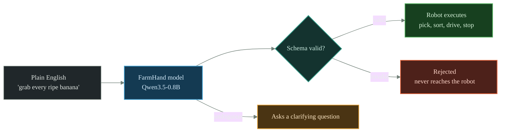
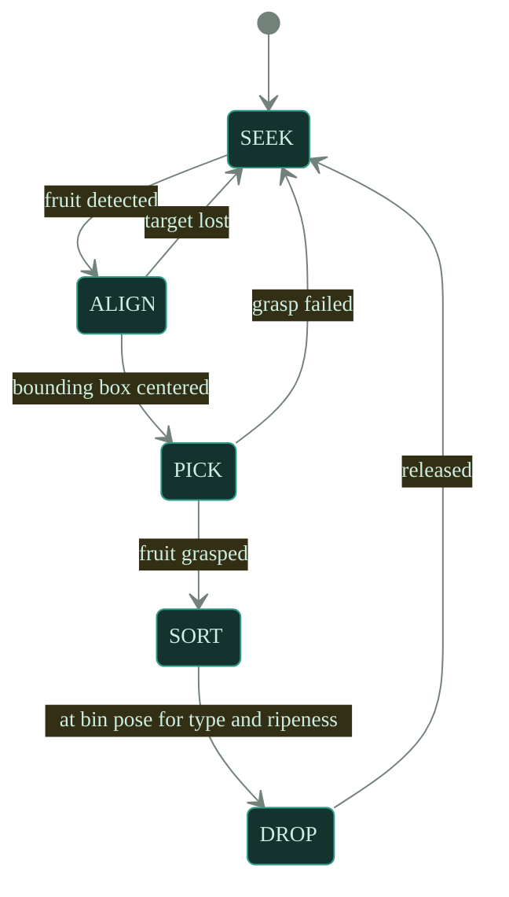

# FarmHand system architecture (diagrams)

Canonical Mermaid source for the pitch, the Devpost, and slides. GitHub and
Devpost render these inline. A styled, screenshot-ready version is the artifact
built from `scratchpad/architecture.html`. Style rule: no emojis, no em dashes.

Color key: cool teal and blue = perception and AI brain (Linux MPU); warm amber =
real-time control brain (MCU); red-orange = safety only; green = web and data;
slate = raw sensors and actuators.

## 1. Dual-brain architecture and technology stack

```mermaid
%%{init: {'theme':'base','flowchart':{'htmlLabels':true,'curve':'basis'},'themeVariables':{'fontFamily':'ui-sans-serif, system-ui, sans-serif','background':'#0e1512','primaryColor':'#16211c','primaryTextColor':'#e7efe9','primaryBorderColor':'#3a4842','lineColor':'#728179','clusterBkg':'#121b17','clusterBorder':'#2b3a33','fontSize':'14px'}}}%%
flowchart TB
  PAD["PlayStation controller<br/>Gamepad API"]:::io

  subgraph ROBOT["FarmHand robot"]
    direction TB
    subgraph MPU["Perception and planning  :  Qualcomm QRB2210, Debian Linux, about 5 W"]
      direction TB
      CAM["Eye-in-hand camera"]:::io
      VIS["Vision model<br/>YOLOv8n int8, on-device<br/>OpenCV HSV fallback"]:::ai
      LLM["FarmHand model<br/>Qwen3.5-0.8B, NL to validated JSON"]:::sky
      SM["Pick and sort state machine<br/>SEEK, ALIGN, PICK, SORT, DROP"]:::mpu
      SLAM["Lidar reader and SLAM-lite"]:::mpu
      CAM --> VIS --> SM
      LLM --> SM
      SLAM --> SM
    end
    subgraph MCU["Real-time control and safety  :  STM32U585"]
      direction TB
      DRV["Tank-drive PWM"]:::mcu
      SRV["Servo interpolation<br/>PCA9685, 20 ms, no snapping"]:::mcu
      EST["Ultrasonic reflex stop<br/>under 10 ms"]:::safety
      WD["Motion watchdog<br/>500 ms"]:::safety
    end
    MPU <-->|"App Lab Bridge · MsgPack-RPC"| MCU
  end

  subgraph SENSE["Sensors and actuators"]
    direction LR
    LIDAR["RPLIDAR C1, 360 degrees"]:::io
    SONAR["HC-SR04 ultrasonic"]:::io
    MOTORS["2 drive motors"]:::io
    ARM["5 arm servos and gripper"]:::io
  end

  subgraph OFF["Laptop server and web"]
    direction TB
    HUB["Socket.IO hub<br/>Express, Node.js"]:::web
    DASH["Dashboard<br/>React, Three.js, Vite"]:::web
    DB["MongoDB Atlas"]:::web
    AUTH["Auth0 operator login"]:::web
    VER["Vercel"]:::web
    B44["Base44 webhook<br/>Orchard OS"]:::web
    HUB --> DASH
    HUB --> DB
    DASH --> AUTH
    DASH --> VER
    HUB --> B44
  end

  LIDAR --> SLAM
  SONAR --> EST
  DRV --> MOTORS
  SRV --> ARM
  MPU -->|"telemetry, detections, pick events"| HUB
  HUB -->|"drive, arm, pick, estop, nl_command"| MPU
  PAD --> DASH

  classDef io fill:#20272a,stroke:#8a978f,color:#e2e8e4,stroke-width:1px;
  classDef ai fill:#123f39,stroke:#33b89a,color:#d3f3ea,stroke-width:1.5px;
  classDef sky fill:#143a52,stroke:#4aa8d8,color:#d6ecfb,stroke-width:1.5px;
  classDef mpu fill:#14332f,stroke:#2f9d88,color:#cdeee3,stroke-width:1.5px;
  classDef mcu fill:#4a3413,stroke:#e6a53f,color:#ffe8c6,stroke-width:1.5px;
  classDef safety fill:#4d211a,stroke:#e5643c,color:#ffd7cb,stroke-width:1.5px;
  classDef web fill:#17401f,stroke:#4fae5a,color:#d7f2da,stroke-width:1.5px;

  style ROBOT fill:#0c1310,stroke:#33463d
  style MPU fill:#0f1a20,stroke:#2a5560
  style MCU fill:#1f1710,stroke:#5a4322
  style SENSE fill:#15191b,stroke:#3a4640
  style OFF fill:#0f1a12,stroke:#274d2c
```

## 2. FarmHand command safety gate

Invalid model output physically cannot reach the robot.

## 3. Pick and sort state machine

