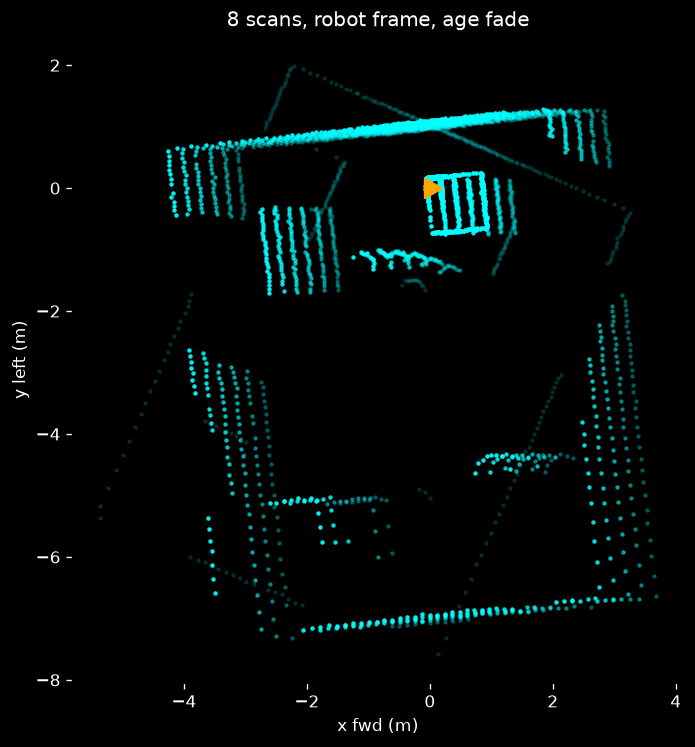

# Lidar — how it works, what you should see, how to visualize it

This is the overview. Deep-dives live in the subfolder READMEs:
`pi/SETUP.md` (hardware), `sim/README.md` (synthetic source),
`sim/DECAY.md` (accumulation/fade spec), `phone/README.md` (3D world).

> **If the dashboard "doesn't look right," read [Previewing without hardware](#previewing-without-hardware-read-this-first) first.** 99% of the time it's the wrong data source, not a rendering bug — see [REVIEW-NOTES.md](REVIEW-NOTES.md).

---

## The 30-second version

There are **two independent lidar systems**, and they are not the same thing:

| | **RPLIDAR C1** (live) | **iPhone lidar** (static) |
|---|---|---|
| What | 2D 360° spinning lidar on the robot | Handheld 3D room scan, done once |
| Output | live 2D points + a SLAM map, ~2 Hz | one colored 3D mesh (`world.glb`) |
| Frame | robot-centered, or world via SLAM pose | fixed room, captured ahead of time |
| Role | "what's around me + a map I'm building" | the pretty 3D backdrop |
| Code | `robot/lidar/pi/` | `robot/lidar/phone/` |

The dashboard (`/lidar`) layers **three** things:
1. the static 3D room (`world.glb`) as a backdrop,
2. a **persistent SLAM occupancy map** (green cells that accumulate as the robot
   drives) + an **amber marker** at the robot's estimated pose, and
3. the **live C1 sweep** on top as a fading point cloud (~2 s decay).

Items 2 and 3 come from the robot; item 1 is pre-captured.

---

## The three data streams (this is the contract)

Emitted by the robot (or a sim), validated in `web/server/schemas.js`, relayed
by the hub only from `role=robot` clients to the dashboards:

| Event | Rate | Payload | Drives |
|---|---|---|---|
| `lidar_scan` | ~2 Hz | `{ts, points:[[x,y]…]}` meters, robot frame, ≤360 pts | the fading live sweep |
| `slam_pose` | ~2 Hz | `{ts, x, y, theta}` world meters | the amber robot marker |
| `slam_map` | ~0.5 Hz | `{ts, data(b64 uint8), width, height, resolution, origin}` ≤128×128 | the green occupancy map |

- `ts` is epoch **milliseconds** (13 digits). Not seconds.
- `lidar_scan` frame: `x` = forward, `y` = left, robot at origin. It carries **no
  pose** on its own — that's what `slam_pose` is for.
- With a pose, the dashboard lifts each scan into the world frame so it lands on
  the accumulated map; **without a pose it falls back to a robot-centered radar**
  (points drawn around the origin, no persistent map). This fallback is why a
  lidar-only source still shows *something*, just not the map.

Coordinate mapping to Three.js (see `LidarViewport.jsx` `worldToThree`):
`three (X,Y,Z) = (−y, SENSOR_H, −x)`, `SENSOR_H = 0.15 m`.

---

## Two producers on the real robot

On real hardware the Pi runs **two** things, both connecting as `role=robot`:

- **`robot/lidar/pi/lidar_node/`** — reads the C1 over serial, emits `lidar_scan`.
  Run: `SERVER_URL=http://<laptop-ip>:3001 ./run.sh`.
- **`robot/lidar/pi/slam/node.py`** — consumes scans, runs SLAM-lite, emits
  `slam_pose` + `slam_map`. Without this, you get the radar fallback, no map.

Two things that silently break the live path:

- **`role=robot` on connect.** The hub drops every event from a client that
  didn't connect with `auth={"role":"robot"}` (it's treated as a dashboard).
  `emit` still "succeeds," nothing appears. *(This was a real bug in `emitter.py`
  — connected without the role and dropped 100% of scans; fixed. See REVIEW-NOTES.)*
- **Same, non-isolated network.** eduroam / UofT WiFi isolate clients — the Pi
  can't reach the laptop. Use the phone hotspot **`Shiba 8`**; `SERVER_URL` must
  be the laptop's hotspot IP, never `localhost`.

---

## Previewing without hardware (READ THIS FIRST)

There are **three** simulators and they are NOT interchangeable. Using the wrong
one is the #1 reason the dashboard looks wrong:

| Sim | How to run | Emits | Coherent `/lidar` view? |
|---|---|---|---|
| **Browser sim** `web/src/lib/sim.js` | open **`/lidar?sim=1`** — no backend at all | lidar_scan + slam_pose + slam_map + telemetry | ✅ **yes — use this** |
| Node sim `web/server/sim.js` | `SERVER_URL=… npm run sim` (needs hub) | same full set | ✅ yes *(but see blob dep in REVIEW-NOTES)* |
| Python sim `robot/lidar/sim/sim.py` | `SERVER_URL=… .venv/bin/python sim.py` | **`lidar_scan` only** | ⚠️ radar only — **no map, no pose marker** |

**To just look at the dashboard: run the frontend, open `http://localhost:5173/lidar?sim=1`.**
That's it — the browser sim generates the full stream client-side, so you see the
green map building, the amber marker moving, and the live sweep, exactly as the
real robot would drive it. No hub, no hotspot, no Python.

```bash
cd web && npm install && npm run dev     # → http://localhost:5173/lidar?sim=1
```

The Python `sim.py` is for **testing the lidar data path** (Pi → hub → wire), not
for a pretty dashboard — it deliberately sends only `lidar_scan`.

---

## What you should be seeing

**Coherent view (`?sim=1` or real robot with SLAM):** a green occupancy map that
**accumulates and stays put** as the amber marker glides around it, with the live
360° sweep flickering on top and fading over ~2 s, all on the cream background
over the `world.glb` room.

**Radar fallback (lidar-only source, no pose):** just the robot at the origin with
a fading ring of points — walls as arcs, obstacles as clusters, ~340–360 pts,
updating twice a second. No green map, no amber marker. Here's `sim/viz.py`
rendering that fallback (8 accumulated scans):



Healthy signs on the wire: hub `/api/health` → `clients.robot ≥ 1`,
`robot_connected: true`; Pi log `emitted N scans (last: ~360 pts)`.

Bad signs: connected but empty → the `role=robot` / `SERVER_URL=localhost` traps
above. `NO_DEVICE` → C1 not enumerated (`ls /dev/ttyUSB* /dev/ttyACM*`, dialout
group). Points rotated/mirrored → tune `ANGLE_OFFSET_DEG` (`ANGLE_CCW=1` if
mounted upside down).

---

## Offline renderers (no browser — slides / backup footage)

- `sim/viz.py out.png 8` — still image of N accumulated scans (image above).
- `sim/tour.py tour.mp4` — scripted tour + SLAM map assembling in real time;
  needs `matplotlib` + system `ffmpeg`. Good backup demo of "robot maps a room."

## Foxglove / ROS tooling — not wired, and we don't need it

The dashboard **is** our Foxglove: `web/`'s `LidarViewport.jsx` renders the world
+ SLAM map + live sweep and speaks our Socket.IO schema natively. Real Foxglove
would need an MCAP export or a `foxglove-websocket` bridge translating our events
→ Foxglove `PointCloud`/`LaserScan` — real work for no gain over the built-in
viewer. If we ever want `.mcap` record/replay it's a ~1-file adapter that
subscribes as a `ui` client and republishes; open an issue, don't block on it.

---

## Bring-up on real hardware (both devices on `Shiba 8`)

Full detail in `pi/SETUP.md`. Short path:

1. **Laptop** onto `Shiba 8`; note its IP (`ip -4 addr show`), e.g. `192.168.43.12`.
2. **Hub + dashboard** on the laptop (`web/server`: `PORT=3001 npm start`; `web`:
   `npm run dev`). Hub binds all interfaces, so the Pi can reach `:3001`.
3. **Pi** onto `Shiba 8`; SSH in; confirm the C1 (`ls /dev/ttyUSB* /dev/ttyACM*`).
4. Start **both** producers on the Pi:
   `SERVER_URL=http://<laptop-ip>:3001 ./run.sh` (lidar) and the SLAM node — else
   you only get the radar fallback.
5. Watch `/lidar`. Empty → re-check the two traps above.

**No hardware / lidar dies at the venue:** `LIDAR_MOCK=1 ./run.sh` streams a
synthetic room through the identical pipeline; or just demo `/lidar?sim=1`.
